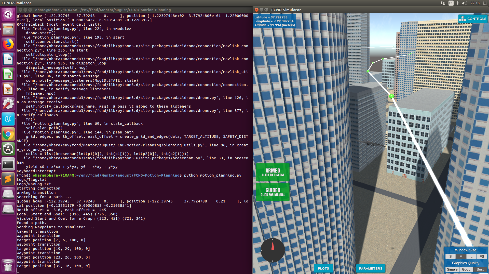
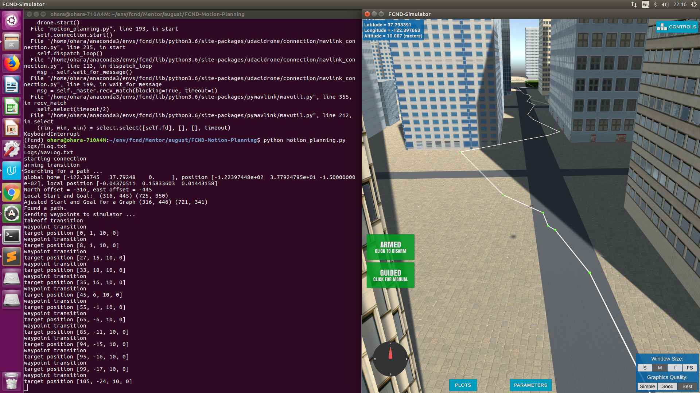
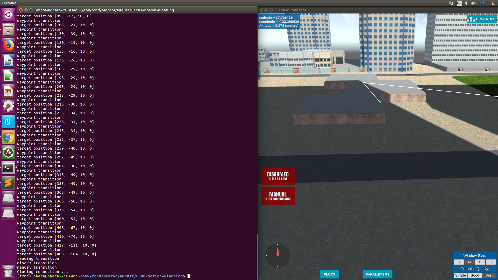

# Flying Car Motion Planning Project

This projects explores methods of planning an UAV Flight Path discussed in lectures.

A robust Flight Planner usually includes 3 parts, but all three aren't required for a basic one. A hierarchical Flight Planners architecture include:

1. Global Flight Planner - for plotting a rough path on scale of a city map
2. Local Flight Planner - for planning path on scale of a city block
3. Dynamic Flight Planner - for integrating stochastic nature of real world or incorporating vehicle dynamics

Version submitted for a review includes a Global Flight Planner.

## Explain the Starter Code

**plan_path()** is core method of this Flight Planner. It operates as follows:

1. Reading an area map into memory
2. Converting local position in position on area map
3. Building a flight path on area map
4. Executing a flight path

As we are operating on scale of local map, we converting our global coordinates into local. On the other hand resulting flight path way-points are in global coordinates, so we need to be able to convert back and forth.

We can build a Flight Path using various methods, but result should be a feasible set of way-points for a vehicle to follow.

## Implementing Your Path Planning Algorithm

Flight planning algorithm in this project is based on a graph approach when we convert a local map into a graph and then find a feasible path on that graph. It is implemented as follows:

1. Create a grid representation of local map for given altitude. A grid is a 2-d matrix, whose elements set to 1 for obstacles (building, etc).
2. Build a Voronoi Graph diagram for a list of obstacle centers
3. For each Voronoi Graph vertex check a feasibility of path. To check a feasibility we use a ray tracing algorithm for a collision detection.
4. All feasible vertices are used to calculate a flight path by applying an A* search algorithm. We choose closest points to start and destination to traverse on that map.
5. We then convert local way-points to global coordinates and execute them.

Note that this flight planner is a Global Flight Planner. Further iterations of this project may include a Local and Dynamic Flight Planners for better robustness.

## Executing the flight

Flight path is executed on global coordinate waypoints.

